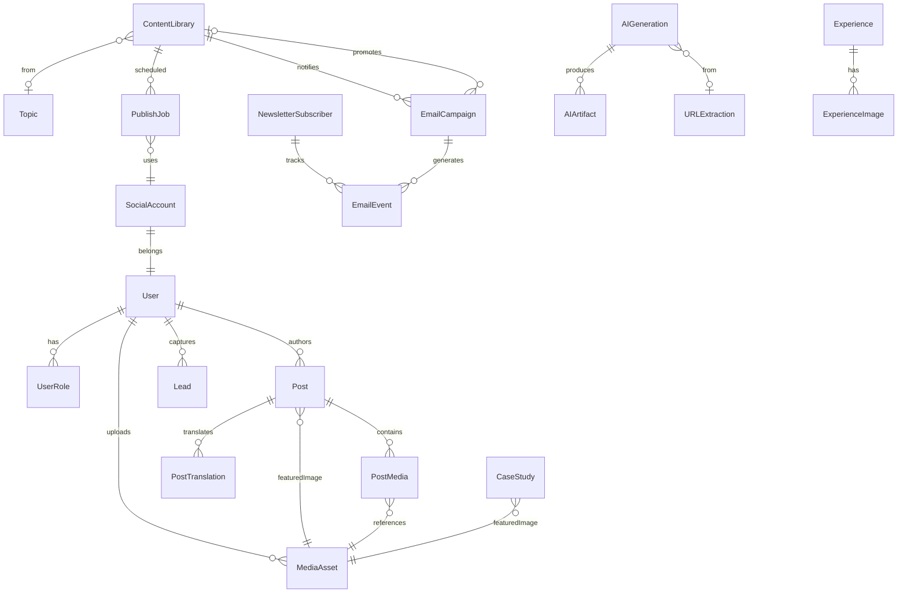
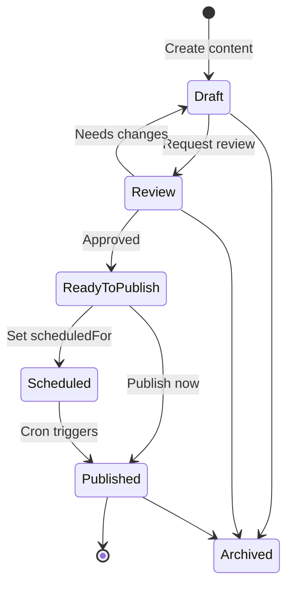
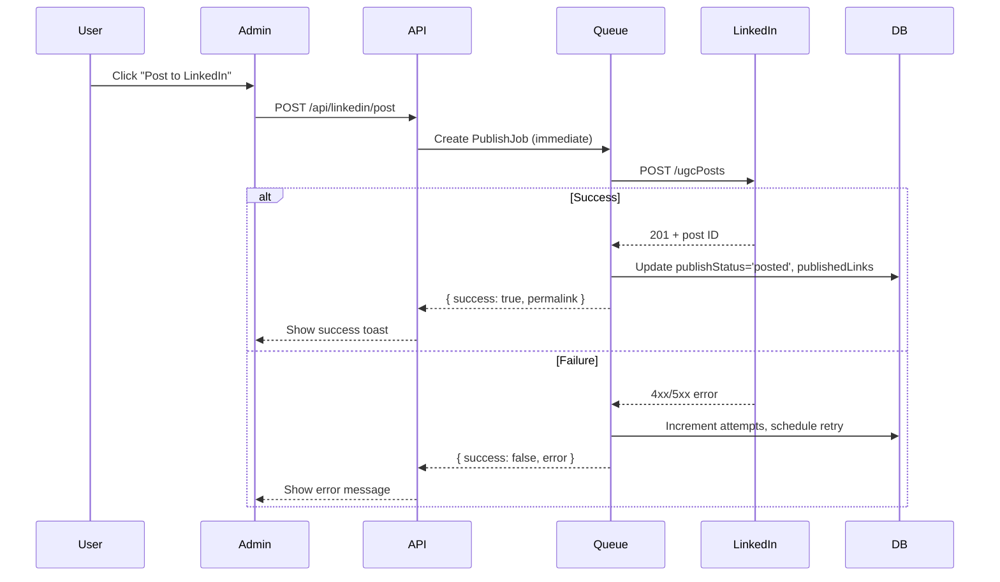
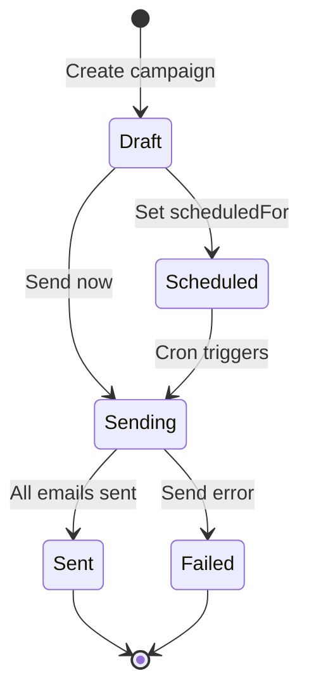
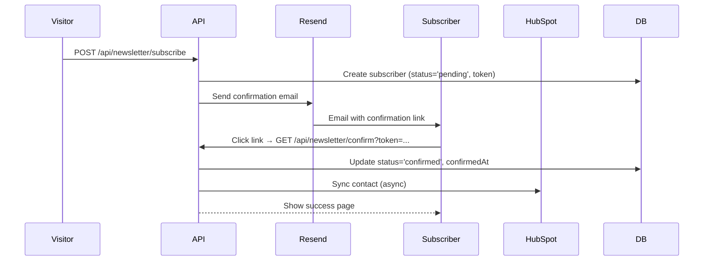
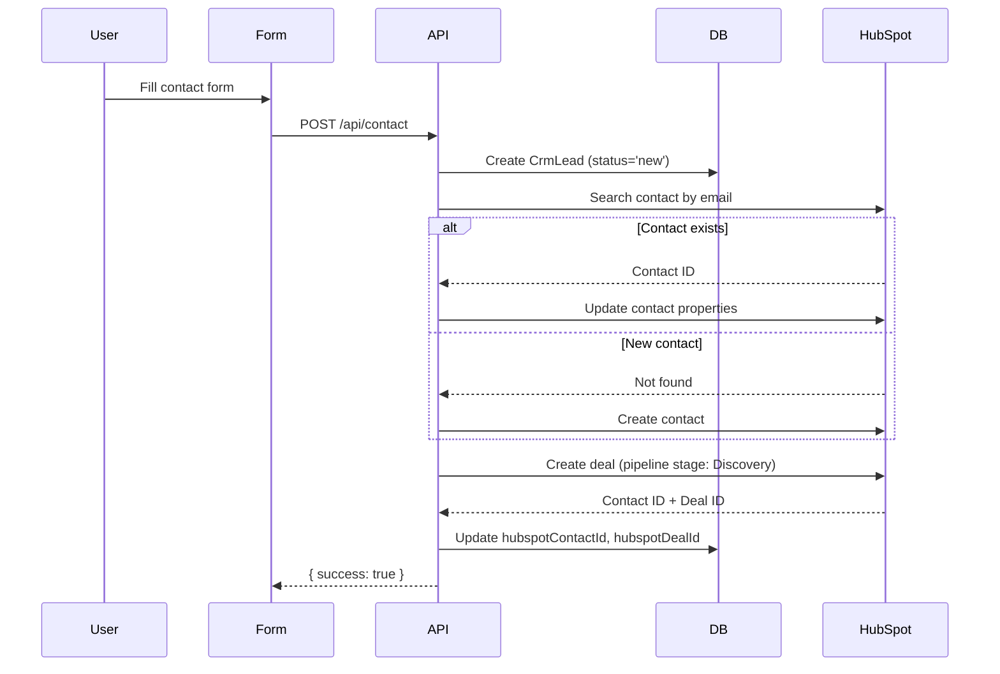
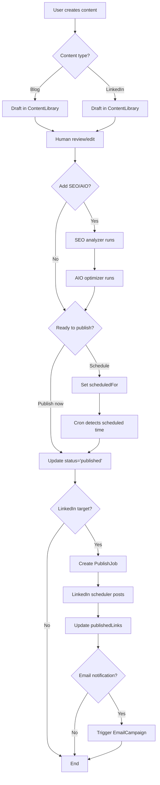

# API & Logic Map
**Data Models, Endpoints, and Business Logic**

> **Generated:** December 2024  
> **Purpose:** Complete API and data flow documentation

---

## Table of Contents
1. [Database Schema Overview](#database-schema-overview)
2. [Entity Relationship Diagram](#entity-relationship-diagram)
3. [API Endpoints Catalog](#api-endpoints-catalog)
4. [Business Logic & Workflows](#business-logic--workflows)
5. [Background Jobs](#background-jobs)

---

## Database Schema Overview

### Schema Summary (34 models)

| Model | Purpose | Key Relations |
|-------|---------|---------------|
| **User** | System users with RBAC | → UserRole, MediaAsset, Post, Lead |
| **UserRole** | Role assignments | ← User |
| **Content Models** |||
| **Post** | Blog posts (legacy/CMS) | → PostMedia, PostTranslation, MediaAsset |
| **PostTranslation** | Multilingual translations | ← Post |
| **ContentLibrary** | Modern content (blogs, LinkedIn) | → Topic, PublishJob, EmailCampaign |
| **Topic** | Content ideas & research | → ContentLibrary |
| **LinkedInPost** | LinkedIn-specific content | - |
| **Media Models** |||
| **MediaAsset** | Rich media library | → PostMedia, Post, CaseStudy |
| **MediaLibrary** | Alternative media storage | - |
| **PostMedia** | Post-media join table | ← Post, MediaAsset |
| **AI Models** |||
| **AIGeneration** | AI content requests | → AIArtifact, URLExtraction |
| **AIArtifact** | Generated AI content | ← AIGeneration |
| **AIConfig** | AI model configuration | - |
| **AIPromptTemplate** | Reusable AI prompts | - |
| **URLExtraction** | Extracted URL content | ← AIGeneration |
| **Marketing Models** |||
| **NewsletterSubscriber** | Email subscribers | → EmailEvent |
| **EmailCampaign** | Email marketing campaigns | → EmailEvent, ContentLibrary |
| **EmailEvent** | Email analytics events | ← EmailCampaign, NewsletterSubscriber |
| **EmailTemplate** | Reusable email templates | - |
| **Social Models** |||
| **SocialAccount** | OAuth social connections | - |
| **PublishJob** | Social post queue/history | ← ContentLibrary |
| **CRM Models** |||
| **Lead** | Contact form leads (legacy) | ← User |
| **CrmLead** | Modern CRM leads | - |
| **Portfolio Models** |||
| **CaseStudy** | Portfolio projects | → MediaAsset |
| **Experience** | Work history | → ExperienceImage |
| **ExperienceImage** | Experience screenshots | ← Experience |
| **Site CMS Models** |||
| **HeroTitle** | Homepage hero text | - |
| **HeroMedia** | Homepage hero media | - |
| **SiteLogo** | Site branding logos | - |
| **SocialEmbed** | Social media embed configs | - |
| **System Models** |||
| **SEOEntry** | SEO metadata cache | - |
| **Audit** | Audit trail | ← User |
| **JobRun** | Background job tracking | - |
| **Subscriber** | Generic subscription (legacy) | - |

---

## Entity Relationship Diagram



### Core Data Entities

#### Content Management

**ContentLibrary** - Primary content entity
- `id`, `title`, `content` (rich text), `excerpt`, `summary`
- `type`: `'blog' | 'linkedin_post' | 'linkedin_article' | 'linkedin_carousel'`
- `format`: Content format variant
- `status`: `'draft' | 'review' | 'published' | 'archived'`
- `keywords[]`, `seoTitle`, `seoDescription`, `seoScore`
- `publishTargets[]`: `['linkedin', 'instagram']`
- `publishStatus`: `'draft' | 'queued' | 'posting' | 'posted' | 'failed'`
- `publishedLinks`: JSON map `{ linkedin: "url", ... }`
- `scheduledFor`: DateTime for future publishing
- `emailNotificationSent`: Boolean for campaign trigger
- Relations: → Topic, PublishJob[], EmailCampaign (1:1)

**Topic** - Content ideation
- `id`, `title`, `description`, `sourceUrl`
- `priority`: Integer ranking
- `status`: `'new' | 'researching' | 'ready' | 'in_progress' | 'completed' | 'archived'`
- `locked`: Boolean (prevents concurrent editing)
- `assignedTo`: User ID
- `relevanceScore`: Float (AI-calculated)
- Relations: → ContentLibrary[]

#### Media Management

**MediaLibrary** - Modern media storage
- `id`, `filename`, `originalFilename`, `url`, `thumbnailUrl`
- `type`, `mimeType`, `sizeBytes`
- `width`, `height`, `durationSeconds` (for video)
- `altText`, `caption`, `tags[]`, `folder`
- `usedInContent[]`: Array of ContentLibrary IDs
- `uploadedBy`, `createdAt`, `updatedAt`

#### Marketing & Email

**NewsletterSubscriber**
- `id`, `email`, `firstName`, `lastName`
- `status`: `'pending' | 'confirmed' | 'unsubscribed'`
- `confirmationToken`, `confirmationTokenExpiresAt`
- `preferences`: JSON (email types, frequency)
- `source`, `sourceUrl`, `utm*` fields
- `totalOpens`, `totalClicks`, `lastOpenedAt`, `lastClickedAt`
- `hubspotContactId`, `hubspotSyncedAt`
- `tags[]`, `customFields`: JSON
- Relations: → EmailEvent[]

**EmailCampaign**
- `id`, `name`, `subject`, `previewText`
- `fromName`, `fromEmail`, `replyTo`
- `contentHtml`, `contentText`
- `status`: `'draft' | 'scheduled' | 'sending' | 'sent' | 'failed'`
- `scheduledFor`, `sentAt`
- `targetStatus`, `targetTags[]`, `excludeTags[]`
- `provider`: `'resend'`, `providerCampaignId`
- `total*`: Metrics (sent, delivered, opens, clicks, bounces, complaints, unsubscribes)
- `createdBy`, `tags[]`, `notes`
- Relations: → EmailEvent[], ContentLibrary (optional content promotion)

**EmailEvent** - Email analytics
- `id`, `campaignId`, `subscriberId`, `email`
- `eventType`: `'sent' | 'delivered' | 'opened' | 'clicked' | 'bounced' | 'complained' | 'unsubscribed'`
- `linkUrl`, `linkText` (for clicks)
- `bounceType`, `bounceReason`, `complaintFeedbackType`
- `provider`, `providerMessageId`, `providerEventId`
- `ipAddress`, `userAgent`, `location`
- `eventTimestamp`, `createdAt`

#### Social Media

**SocialAccount** - OAuth tokens
- `id`, `userId`, `provider`: `'linkedin' | 'instagram'`
- `accountId`, `accountName`
- `accessToken`, `refreshToken` (encrypted AES-256-GCM)
- `tokenExpiresAt`, `scopes[]`
- `metadata`: JSON (profile info)
- `isActive`, `createdAt`, `updatedAt`

**PublishJob** - Scheduled social posts
- `id`, `contentId`, `platform`: `'linkedin' | 'instagram'`
- `scheduledFor`, `status`: `'pending' | 'processing' | 'completed' | 'failed' | 'cancelled'`
- `attempts`, `maxAttempts`, `lastAttemptAt`, `nextAttemptAt`
- `result`: JSON (response from API)
- `error`, `publishedUrl`

#### CRM

**CrmLead**
- `id`, `email`, `firstName`, `lastName`, `company`, `jobTitle`
- `phone`, `website`, `source`, `sourceUrl`, `message`
- `leadStatus`: `'new' | 'contacted' | 'qualified' | 'converted' | 'lost'`
- `utm*` fields (source, medium, campaign, term, content)
- `hubspotContactId`, `hubspotDealId`, `hubspotSyncedAt`, `hubspotSyncStatus`
- `ipAddress`, `userAgent`, `referrer`
- `customFields`: JSON, `tags[]`
- `assignedTo`, `notes`, `lastContactedAt`, `nextFollowUpAt`

#### AI Generation

**AIGeneration** - AI request tracking
- `id`, `type`: `'CONTENT_DRAFT' | 'OUTLINE' | 'FACT_CHECK' | 'SEO_META' | 'TRANSLATION' | 'SUMMARY' | 'IDEA'`
- `model`: Enum (GPT4, CLAUDE3_SONNET, etc.)
- `prompt`, `systemPrompt`, `temperature`
- `status`: `'PENDING' | 'PROCESSING' | 'COMPLETED' | 'FAILED'`
- `inputData`, `outputData`: JSON
- `tokensUsed`, `cost`, `durationMs`
- `userId`, `contentId` (optional link to ContentLibrary)
- Relations: → AIArtifact[], URLExtraction (optional)

---

## API Endpoints Catalog

### Authentication & Authorization

| Method | Path | Purpose | Auth | Input | Output | Notes |
|--------|------|---------|------|-------|--------|-------|
| GET | `/api/auth/linkedin/connect` | Initiate LinkedIn OAuth | Public | - | Redirect to LinkedIn | State param for security |
| GET | `/api/auth/linkedin/callback` | OAuth callback handler | Public | `?code=...&state=...` | Redirect to /social | Exchanges code for tokens |
| POST | `/api/auth/linkedin/disconnect` | Revoke LinkedIn connection | Auth | - | `{ success: true }` | Deletes SocialAccount record |
| GET | `/api/auth/linkedin/status` | Check LinkedIn connection | Auth | - | `{ connected: bool, account: {...} }` | Returns account details |
| GET | `/auth/login` | Login page | Public | - | HTML | Supabase email/password |
| GET | `/auth/logout` | Logout | Auth | - | Redirect to /login | Clears session |
| GET | `/api/health` | System health check | Public | - | `{ status, checks: {...} }` | DB, storage, auth status |

### Content Management

| Method | Path | Purpose | Auth | Input | Output |
|--------|------|---------|------|-------|--------|
| GET | `/api/content-library` | List content | Auth | `?type=blog&status=published` | `{ items: [...] }` |
| POST | `/api/content-library` | Create content | Auth | `{ title, content, type, ... }` | `{ id, ... }` |
| GET | `/api/content-library/[id]` | Get single content | Auth | - | `{ id, title, ... }` |
| PUT | `/api/content-library/[id]` | Update content | Auth | `{ title, content, ... }` | `{ id, ... }` |
| DELETE | `/api/content-library/[id]` | Delete content | Auth | - | `{ success: true }` |

### Topics

| Method | Path | Purpose | Auth | Input | Output |
|--------|------|---------|------|-------|--------|
| GET | `/api/topics` | List topics | Auth | `?status=ready&priority=desc` | `{ items: [...] }` |
| POST | `/api/topics` | Create topic | Auth | `{ title, description, sourceUrl, ... }` | `{ id, ... }` |
| GET | `/api/topics/[id]` | Get single topic | Auth | - | `{ id, title, ... }` |
| PUT | `/api/topics/[id]` | Update topic | Auth | `{ title, status, ... }` | `{ id, ... }` |
| DELETE | `/api/topics/[id]` | Delete topic | Auth | - | `{ success: true }` |
| POST | `/api/topics/[id]/lock` | Toggle topic lock | Auth | `{ locked: true }` | `{ locked: true }` |

### Media Library

| Method | Path | Purpose | Auth | Input | Output |
|--------|------|---------|------|-------|--------|
| GET | `/api/media-library` | List media | Auth | `?type=image&folder=blog` | `{ items: [...] }` |
| POST | `/api/media-library` | Create media record | Auth | `{ filename, url, type, ... }` | `{ id, ... }` |
| POST | `/api/media-library/upload` | Upload file | Auth | FormData (multipart) | `{ id, url, ... }` |
| GET | `/api/media-library/[id]` | Get single media | Auth | - | `{ id, url, ... }` |
| PUT | `/api/media-library/[id]` | Update media metadata | Auth | `{ altText, caption, tags, ... }` | `{ id, ... }` |
| DELETE | `/api/media-library/[id]` | Delete media | Auth | - | `{ success: true }` |

### AI Generation

| Method | Path | Purpose | Auth | Input | Output |
|--------|------|---------|------|-------|--------|
| POST | `/api/ai/outline` | Generate content outline | Auth | `{ topic, keywords, ... }` | `{ outline: [...] }` |
| POST | `/api/ai/facts` | Extract & verify facts | Auth | `{ content }` | `{ facts: [...] }` |
| POST | `/api/ai/facts/approve` | Approve fact for use | Auth | `{ factId }` | `{ success: true }` |
| POST | `/api/ideas/generate` | Generate topic ideas | Auth | `{ keywords, industry, ... }` | `{ ideas: [...] }` |
| POST | `/api/admin/ai/generate` | General AI generation | Auth | `{ type, model, prompt, ... }` | `{ result, tokensUsed, ... }` |
| POST | `/api/admin/ai/translate` | Translate content | Auth | `{ text, targetLang, ... }` | `{ translatedText }` |
| POST | `/api/admin/ai/extract-url` | Extract content from URL | Auth | `{ url }` | `{ title, content, ... }` |

### LinkedIn Publishing

| Method | Path | Purpose | Auth | Input | Output |
|--------|------|---------|------|-------|--------|
| POST | `/api/linkedin/post` | Post to LinkedIn immediately | Auth | `{ contentId, text, images?, ... }` | `{ success, permalink, ... }` |
| POST | `/api/linkedin/schedule` | Schedule LinkedIn post | Auth | `{ contentId, scheduledFor }` | `{ jobId, scheduledFor }` |
| DELETE | `/api/linkedin/schedule` | Cancel scheduled post | Auth | `{ jobId }` | `{ success: true }` |
| GET | `/api/scheduler/run` | Process scheduled jobs (cron) | Cron Secret | - | `{ processed: N }` |

### Email Marketing

| Method | Path | Purpose | Auth | Input | Output |
|--------|------|---------|------|-------|--------|
| POST | `/api/newsletter/subscribe` | Subscribe to newsletter | Public | `{ email, firstName?, lastName?, ... }` | `{ success, requiresConfirmation }` |
| GET | `/api/newsletter/confirm` | Confirm subscription | Public | `?token=...` | `{ success, email }` |
| GET/POST | `/api/newsletter/unsubscribe` | Unsubscribe | Public | `?email=...` or `{ email }` | `{ success }` |
| GET | `/api/email/campaigns` | List campaigns | Auth | `?status=sent` | `{ campaigns: [...] }` |
| POST | `/api/email/campaigns` | Create campaign | Auth | `{ name, subject, contentHtml, targetStatus, ... }` | `{ id, ... }` |
| POST | `/api/email/campaigns/[id]/send` | Send campaign | Auth | - | `{ success, totalSent }` |
| POST | `/api/email/scheduler/run` | Process scheduled campaigns (cron) | Cron Secret | - | `{ processed: N }` |
| POST | `/api/webhooks/resend` | Resend webhook handler | Webhook Secret | Resend event payload | `{ received: true }` |

### CRM

| Method | Path | Purpose | Auth | Input | Output |
|--------|------|---------|------|-------|--------|
| POST | `/api/contact` | Submit contact form | Public | `{ email, name, message, ... }` | `{ success }` |
| POST | `/api/crm/sync` | Sync leads to HubSpot (cron) | Cron Secret | - | `{ synced: N }` |

---

## Business Logic & Workflows

### Content Publishing Workflow



**Logic:**
1. Create content with `status='draft'`
2. User clicks "Request Review" → `status='review'`
3. Reviewer approves → `status='published'` OR schedules → `scheduledFor` set
4. If scheduled: Cron job checks `scheduledFor <= now()` and publishes
5. Publishing: Updates `status='published'`, `publishedAt=now()`

### LinkedIn Publishing Flow



**Retry Logic:**
- Exponential backoff: 5min, 15min, 1hr
- Max 3 attempts
- After 3 failures: Mark as `failed` and surface error

### Email Campaign Lifecycle



**Process:**
1. Create campaign with targets (status, tags)
2. Scheduler queries matching subscribers
3. Batch send via Resend (max 50/batch)
4. Track sends in `EmailEvent` (type='sent')
5. Resend webhooks update events (opened, clicked, bounced)
6. Campaign metrics aggregate from events

### Double Opt-In Subscription



### CRM Lead Capture & Sync



**Nightly Sync (Cron):**
- Query `CrmLead WHERE hubspotSyncStatus != 'synced'`
- Batch sync to HubSpot (max 100/batch)
- Update sync status and timestamps
- Handle failures with retry logic

---

## Background Jobs

### Cron Jobs Configuration

| Job | Endpoint | Schedule | Purpose | Expected Duration |
|-----|----------|----------|---------|-------------------|
| **LinkedIn Scheduler** | `/api/scheduler/run` | `* * * * *` (every minute) | Process queued LinkedIn posts | < 30s |
| **Email Scheduler** | `/api/email/scheduler/run` | `* * * * *` (every minute) | Send scheduled email campaigns | < 45s |
| **CRM Sync** | `/api/crm/sync` | `0 2 * * *` (daily at 2 AM) | Sync leads & subscribers to HubSpot | < 5min |

### Job Authentication

All cron jobs require `Authorization: Bearer ${CRON_SECRET}` header.

**Implementation:**
```typescript
// Example cron endpoint
export async function GET(request: NextRequest) {
  const authHeader = request.headers.get('authorization');
  const token = authHeader?.replace('Bearer ', '');
  
  if (token !== process.env.CRON_SECRET) {
    return NextResponse.json({ error: 'Unauthorized' }, { status: 401 });
  }
  
  // Process job...
}
```

### Job Execution Flow

#### LinkedIn Scheduler
1. Query `PublishJob WHERE status='pending' AND scheduledFor <= now()`
2. For each job:
   - Get associated `ContentLibrary` + `SocialAccount`
   - Check token expiry, refresh if needed
   - POST to LinkedIn API
   - Update job status + content publishStatus
   - Record result/error
3. Handle retries for failed jobs

#### Email Scheduler
1. Query `EmailCampaign WHERE status='scheduled' AND scheduledFor <= now()`
2. For each campaign:
   - Query matching subscribers (status, tags)
   - Batch into groups of 50
   - Send via Resend API
   - Create `EmailEvent` records (type='sent')
   - Update campaign metrics
3. Update campaign status to 'sent'

---

## Data Flow Diagrams

### Content Creation to Publication



---

**Document Status:** ✅ Complete  
**Last Updated:** December 2024  
**Next Document:** [Auth & Roles](./auth-and-roles.md)

