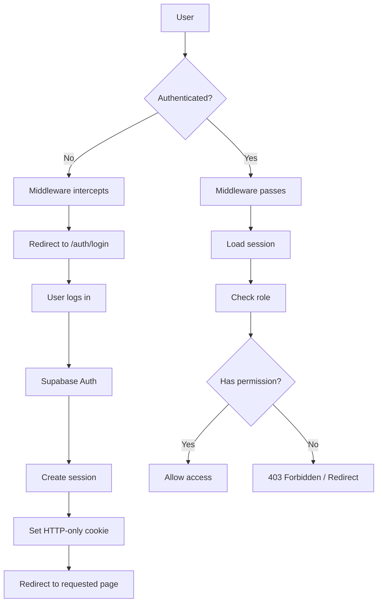
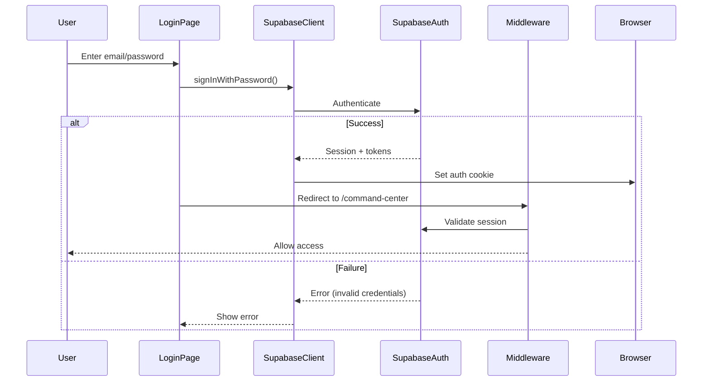
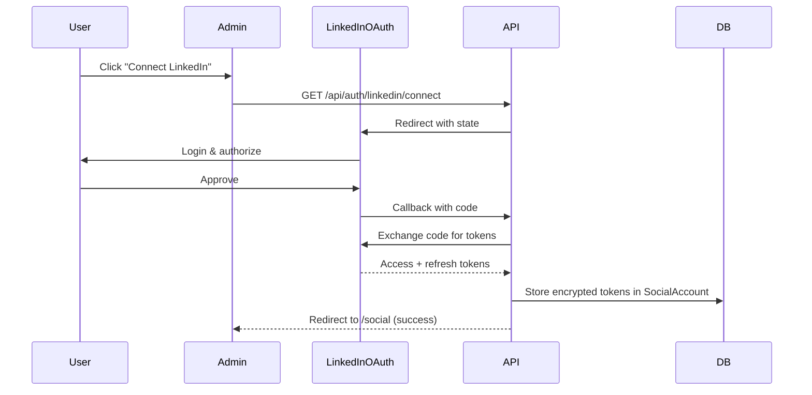
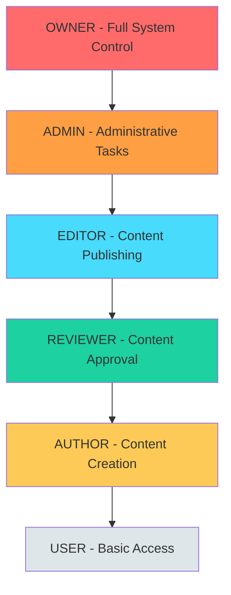
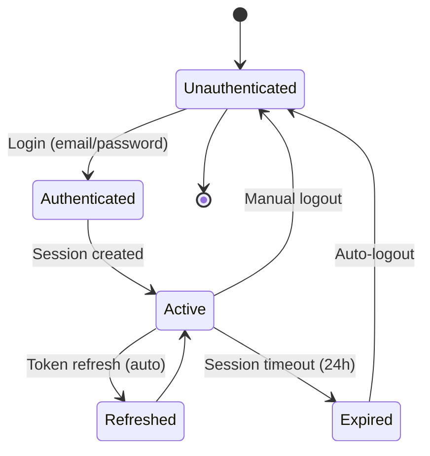

# Authentication & Authorization
**RBAC, RLS, and Security Implementation**

> **Generated:** December 2024  
> **Purpose:** Complete auth & permission documentation

---

## Table of Contents
1. [Authentication Methods](#authentication-methods)
2. [Role-Based Access Control (RBAC)](#role-based-access-control-rbac)
3. [Permissions Matrix](#permissions-matrix)
4. [Row-Level Security (RLS)](#row-level-security-rls)
5. [Session Lifecycle](#session-lifecycle)
6. [Security Implementation](#security-implementation)

---

## Authentication Methods

### Supabase Auth (Primary)

**Method:** Email/Password + OAuth  
**Library:** `@supabase/ssr` (Server-Side Rendering support)  
**Storage:** Server-side sessions via cookies

#### Supported Auth Flows

| Flow | Status | Usage |
|------|--------|-------|
| **Email/Password** | ✅ | Admin login |
| **Magic Link** | ⚠️ Possible | Not currently configured |
| **OAuth (LinkedIn)** | ✅ | LinkedIn social account connection |
| **OAuth (Google)** | ⚠️ Possible | Not currently configured |
| **Phone/SMS** | ❌ | Not supported |

### Authentication Architecture



### Login Flow

**File:** `apps/admin/app/auth/login/page.tsx`



**Implementation:**
```typescript
// Client-side Supabase client
const supabase = createClient();
const { data, error } = await supabase.auth.signInWithPassword({
  email,
  password,
});
```

### OAuth (LinkedIn) Flow

**Purpose:** Connect LinkedIn account for social posting  
**Not for authentication** - Only for API access token storage



**Token Encryption:**
- Algorithm: AES-256-GCM
- Key: `LINKEDIN_ENCRYPTION_KEY` (32-byte hex)
- Storage: Encrypted `accessToken` and `refreshToken` in `SocialAccount` table

---

## Role-Based Access Control (RBAC)

### Role Hierarchy



### Role Definitions

| Role | Level | Typical User | Capabilities |
|------|-------|--------------|-------------|
| **OWNER** | 6 | System administrator / Khaled | All permissions, user management, system config |
| **ADMIN** | 5 | Senior team member | Delete content, view audit logs, manage CMS |
| **EDITOR** | 4 | Content manager | Publish content, manage media, edit any content |
| **REVIEWER** | 3 | Content reviewer | Approve/reject content, view drafts |
| **AUTHOR** | 2 | Content creator | Create & edit own content, submit for review |
| **USER** | 1 | Basic user | Read-only access (currently unused) |

### Role Assignment

**Database:** `UserRole` model (many-to-many User ↔ Role)

```sql
-- Example: Assign ADMIN role to user
INSERT INTO user_roles (user_id, role) 
VALUES ('user-uuid', 'ADMIN');
```

**Code:**
```typescript
import { hasPermission, requirePermission } from '@khaledaun/auth';

// Check permission
if (hasPermission(user, 'publish')) {
  // Allow action
}

// Require permission (throws error if denied)
requirePermission(user, 'deletePost'); // Throws if not ADMIN/OWNER
```

---

## Permissions Matrix

### Detailed Permission Breakdown

| Permission | Description | Roles with Access |
|------------|-------------|-------------------|
| **createPost** | Create new blog posts or LinkedIn content | AUTHOR, EDITOR, ADMIN, OWNER |
| **editPost** | Edit existing posts (own posts for AUTHOR, any for others) | AUTHOR*, EDITOR, ADMIN, OWNER |
| **submitReview** | Submit content for editorial review | AUTHOR |
| **approve** | Approve or reject content in review | REVIEWER, EDITOR, ADMIN, OWNER |
| **publish** | Publish content live | EDITOR, ADMIN, OWNER |
| **deletePost** | Permanently delete content | ADMIN, OWNER |
| **manageMedia** | Upload, organize, delete media assets | AUTHOR, EDITOR, ADMIN, OWNER |
| **manageCMS** | Edit hero section, experiences, case studies | EDITOR, ADMIN, OWNER |
| **manageUsers** | Create, edit, delete users and assign roles | OWNER |
| **viewAudit** | Access audit logs and system reports | ADMIN, OWNER |
| **createSocialEmbed** | Add new social media embeds | EDITOR, ADMIN, OWNER |
| **editSocialEmbed** | Modify social embed configurations | EDITOR, ADMIN, OWNER |
| **deleteSocialEmbed** | Remove social embeds | ADMIN, OWNER |

> *AUTHOR can only edit their own posts (ownership check enforced)

### UI Visibility Matrix

| UI Element | Roles that See It | Notes |
|------------|-------------------|-------|
| **Dashboard** | All | Basic analytics visible to all |
| **Content → New** | AUTHOR+ | Create button visible |
| **Content → Edit (own)** | AUTHOR+ | Authors see edit on their content |
| **Content → Edit (any)** | EDITOR+ | Editors see edit on all content |
| **Content → Delete** | ADMIN+ | Delete button only for admins |
| **Publish Button** | EDITOR+ | Publish/Schedule visible |
| **Review Workflow** | REVIEWER+ | Approve/Reject buttons |
| **Media Library → Upload** | AUTHOR+ | Upload button visible |
| **Media Library → Delete** | EDITOR+ | Delete icon on media items |
| **Topics Queue** | AUTHOR+ | All actions available |
| **AI Features** | AUTHOR+ | AI generation tools |
| **Marketing Dashboard** | EDITOR+ | Email campaigns & subscribers |
| **CRM & Leads** | EDITOR+ | View and manage leads |
| **Social Accounts** | EDITOR+ | Connect/disconnect LinkedIn |
| **Admin → Users** | OWNER | User management page |
| **Admin → Settings** | ADMIN+ | System configuration |
| **Audit Logs** | ADMIN+ | System audit trail |

### Route Protection

**Middleware:** `apps/admin/middleware.ts`

```typescript
export async function middleware(request: NextRequest) {
  const { pathname } = request.nextUrl;
  
  // Public routes
  if (pathname.startsWith('/auth') || pathname.startsWith('/api/health')) {
    return NextResponse.next();
  }
  
  // Check authentication
  const supabase = createServerClient(/*...*/);
  const { data: { user } } = await supabase.auth.getUser();
  
  if (!user) {
    return NextResponse.redirect('/auth/login');
  }
  
  // Role-based route protection
  if (pathname.startsWith('/admin/settings')) {
    const userRoles = await getUserRoles(user.id);
    if (!userRoles.includes('ADMIN') && !userRoles.includes('OWNER')) {
      return NextResponse.redirect('/forbidden');
    }
  }
  
  // Add security headers
  response.headers.set('X-Robots-Tag', 'noindex, nofollow');
  return response;
}
```

---

## Row-Level Security (RLS)

### Supabase RLS Policies

**Implementation:** SQL policies in Supabase database

#### Example Policies

**Content (Write Protection)**
```sql
-- Only authenticated users with EDITOR+ role can insert/update
CREATE POLICY "Content write access" 
ON content_library FOR INSERT 
WITH CHECK (
  auth.uid() IN (
    SELECT user_id FROM user_roles 
    WHERE role IN ('EDITOR', 'ADMIN', 'OWNER')
  )
);
```

**Content (Read - Own Content)**
```sql
-- Authors can read their own content
CREATE POLICY "Authors read own content" 
ON content_library FOR SELECT 
USING (
  author_id = auth.uid() OR
  auth.uid() IN (
    SELECT user_id FROM user_roles 
    WHERE role IN ('EDITOR', 'ADMIN', 'OWNER')
  )
);
```

**Media Assets (Ownership)**
```sql
-- Users can only delete their own uploaded media (unless ADMIN+)
CREATE POLICY "Delete own media" 
ON media_library FOR DELETE 
USING (
  uploaded_by = auth.uid() OR
  auth.uid() IN (
    SELECT user_id FROM user_roles 
    WHERE role IN ('ADMIN', 'OWNER')
  )
);
```

### RLS Coverage

| Table | RLS Enabled | Policy Type | Notes |
|-------|-------------|-------------|-------|
| `content_library` | ✅ | Read: Public, Write: EDITOR+ | Enforces publishing workflow |
| `topics` | ✅ | Read: All, Write: AUTHOR+ | Topic creation |
| `media_library` | ✅ | Read: All, Write: AUTHOR+, Delete: Own/ADMIN | Media protection |
| `media_assets` | ✅ | Similar to media_library | Alternative media table |
| `social_accounts` | ✅ | Own account only | Token security |
| `newsletter_subscribers` | ✅ | Read: EDITOR+, Write: Public (subscribe) | Privacy |
| `email_campaigns` | ✅ | Read/Write: EDITOR+ | Marketing access |
| `crm_leads` | ✅ | Read/Write: EDITOR+ | CRM protection |
| `user_roles` | ✅ | Read: Own, Write: OWNER | Role management |
| `posts` | ✅ | Read: Public, Write: AUTHOR+ | Legacy content |

---

## Session Lifecycle

### Session Management



### Session Details

| Aspect | Implementation |
|--------|---------------|
| **Storage** | HTTP-only cookies (secure, sameSite=lax) |
| **Duration** | 24 hours (configurable in Supabase) |
| **Refresh** | Automatic via `supabase.auth.getSession()` |
| **Revocation** | Server-side via `supabase.auth.signOut()` |
| **CSRF Protection** | SameSite cookies + Supabase state parameter |

### Token Types

| Token | Purpose | Storage | Lifespan |
|-------|---------|---------|----------|
| **Access Token** | API authentication | Cookie (HTTP-only) | 1 hour |
| **Refresh Token** | Renew access token | Cookie (HTTP-only) | 24 hours |
| **LinkedIn Access** | LinkedIn API calls | Database (encrypted) | 60 days |
| **LinkedIn Refresh** | Renew LinkedIn access | Database (encrypted) | No expiry |

---

## Security Implementation

### Encryption

**LinkedIn Tokens (AES-256-GCM)**
```typescript
import crypto from 'crypto';

export function encrypt(text: string): string {
  const key = Buffer.from(process.env.LINKEDIN_ENCRYPTION_KEY!, 'hex');
  const iv = crypto.randomBytes(16);
  const cipher = crypto.createCipheriv('aes-256-gcm', key, iv);
  
  let encrypted = cipher.update(text, 'utf8', 'hex');
  encrypted += cipher.final('hex');
  
  const authTag = cipher.getAuthTag();
  return `${iv.toString('hex')}:${encrypted}:${authTag.toString('hex')}`;
}
```

### Security Headers

**Middleware:** `apps/admin/middleware.ts`

```typescript
// Apply to all /admin routes
response.headers.set('X-Robots-Tag', 'noindex, nofollow');
response.headers.set('X-Frame-Options', 'DENY');
response.headers.set('X-Content-Type-Options', 'nosniff');
```

### API Authentication Patterns

#### Pattern 1: Supabase Auth Check
```typescript
export async function GET(request: NextRequest) {
  const supabase = await createClient();
  const { data: { user } } = await supabase.auth.getUser();
  
  if (!user) {
    return NextResponse.json({ error: 'Unauthorized' }, { status: 401 });
  }
  
  // Continue with authorized request...
}
```

#### Pattern 2: RBAC Permission Check
```typescript
import { requirePermission } from '@khaledaun/auth';

export async function POST(request: NextRequest) {
  const supabase = await createClient();
  const { data: { user } } = await supabase.auth.getUser();
  
  if (!user) {
    return NextResponse.json({ error: 'Unauthorized' }, { status: 401 });
  }
  
  const userRole = await getUserRole(user.id);
  
  try {
    requirePermission({ id: user.id, role: userRole }, 'publish');
  } catch {
    return NextResponse.json({ error: 'Forbidden' }, { status: 403 });
  }
  
  // Continue with publish action...
}
```

#### Pattern 3: Cron Job Authentication
```typescript
export async function GET(request: NextRequest) {
  const authHeader = request.headers.get('authorization');
  const token = authHeader?.replace('Bearer ', '');
  
  if (token !== process.env.CRON_SECRET) {
    return NextResponse.json({ error: 'Unauthorized' }, { status: 401 });
  }
  
  // Continue with cron job...
}
```

### Webhook Verification

**Resend Webhook:**
```typescript
import { verifySignature } from 'resend';

export async function POST(request: NextRequest) {
  const signature = request.headers.get('resend-signature');
  const body = await request.text();
  
  if (!verifySignature(body, signature, process.env.RESEND_WEBHOOK_SECRET!)) {
    return NextResponse.json({ error: 'Invalid signature' }, { status: 401 });
  }
  
  // Process webhook...
}
```

---

## Personas & Access Scenarios

### Persona: Omar (OWNER)

**Role:** System Owner  
**Access:** Full system control

**Typical Actions:**
- Create and manage user accounts
- Assign roles to team members
- Configure system settings
- View all audit logs
- Emergency content deletion
- Billing & subscription management

**Protected Routes:**
- `/admin/users` (user management)
- `/admin/settings` (system config)
- All routes accessible

---

### Persona: Layla (EDITOR)

**Role:** Content Manager  
**Access:** Content publishing & marketing

**Typical Actions:**
- Create and publish content
- Manage email campaigns
- Approve content from authors
- Upload and organize media
- Schedule social media posts
- View marketing analytics
- Manage CRM leads

**Protected Routes:**
- `/content/*` (full access)
- `/marketing/*` (full access)
- `/topics/*` (full access)
- `/media` (full access)
- `/social` (connect/post)
- `/leads` (view/manage)
- ❌ `/admin/users` (no access)

---

### Persona: Ahmed (AUTHOR)

**Role:** Content Creator  
**Access:** Content creation only

**Typical Actions:**
- Create content drafts
- Edit own content
- Submit content for review
- Generate AI content
- Upload media for own use
- Add topics to queue

**Protected Routes:**
- `/content/new` (create)
- `/content/[id]` (only own content)
- `/topics/*` (full access)
- `/media` (upload only)
- `/ai/*` (AI tools)
- ❌ `/marketing/*` (no access)
- ❌ `/leads` (no access)
- ❌ Publish button (not visible)

---

**Document Status:** ✅ Complete  
**Last Updated:** December 2024  
**Next Document:** [Functions & Features](./functions-and-features.md)

