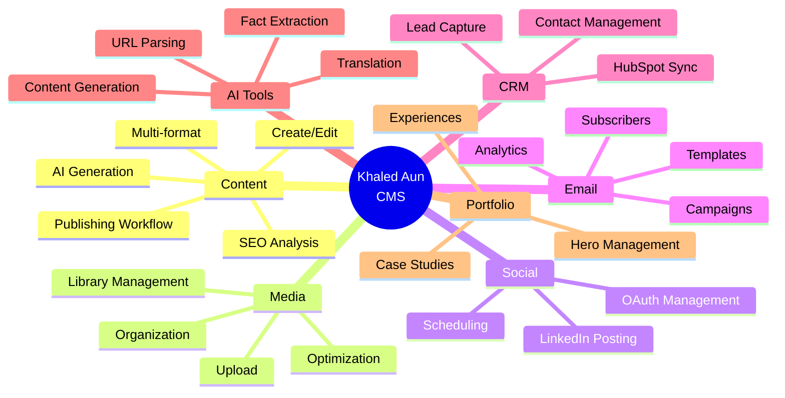
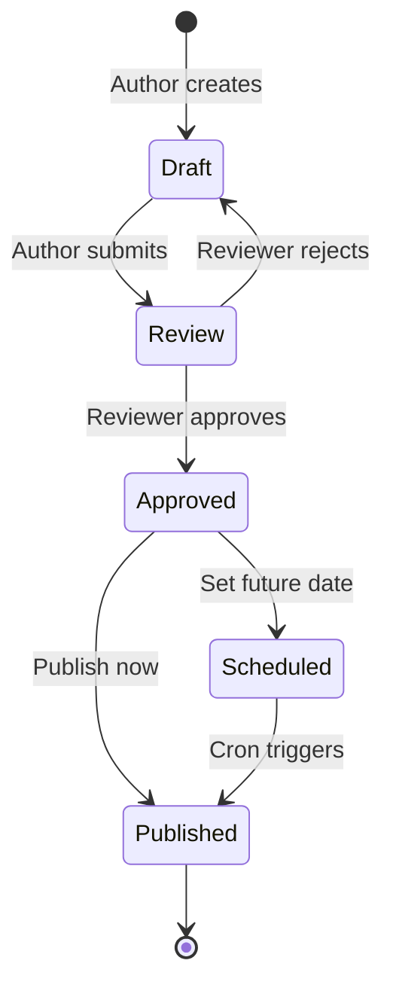

# Functions & Features
**Complete Functional Catalog with Human Usage Scenarios**

> **Generated:** December 2024  
> **Purpose:** Every feature, function, and user journey

---

## Table of Contents
1. [Feature Overview](#feature-overview)
2. [Content Management Features](#content-management-features)
3. [AI & Automation Features](#ai--automation-features)
4. [Social Media Features](#social-media-features)
5. [Email Marketing Features](#email-marketing-features)
6. [CRM & Lead Management](#crm--lead-management)
7. [Utility Functions](#utility-functions)

---

## Feature Overview

### System Capabilities Map



---

## Content Management Features

### 1. Create Content

**Human Intent:** "I want to write a new blog post / LinkedIn post"

**User Action:** Click "New Content" button → Fill form → Save

**Process:**
1. User navigates to `/content/new`
2. Selects content type: `blog | linkedin_post | linkedin_article | linkedin_carousel`
3. Enters title, content (rich text), excerpt
4. (Optional) Adds keywords, SEO metadata
5. (Optional) Attaches media from library
6. (Optional) Links to topic from queue
7. Clicks "Save Draft"

**API:** `POST /api/content-library`

**Input:**
```json
{
  "title": "10 Tips for Better Content Marketing",
  "content": "<p>Rich HTML content...</p>",
  "excerpt": "Short summary...",
  "type": "blog",
  "keywords": ["marketing", "content", "SEO"],
  "seoTitle": "Content Marketing Tips | Khaled Aun",
  "seoDescription": "Learn the top strategies...",
  "status": "draft",
  "topicId": "topic-uuid-optional"
}
```

**Output:**
```json
{
  "id": "content-uuid",
  "title": "...",
  "status": "draft",
  "createdAt": "2024-12-01T10:00:00Z"
}
```

**Dependencies:**
- Supabase Auth (user must be authenticated)
- Prisma (`contentLibrary.create`)
- Permission: `createPost` (AUTHOR+)

**Error States:**
- ❌ Validation failed (missing title/content)
- ❌ Unauthorized (no auth token)
- ❌ Forbidden (insufficient permissions)
- ❌ Database error (Prisma failure)

**UI Feedback:**
- ✅ Success toast: "Draft saved successfully"
- ✅ Redirect to `/content/[id]` for editing
- ❌ Error toast with specific message

---

### 2. SEO Analysis & Scoring

**Human Intent:** "Is my content optimized for search engines?"

**User Action:** Type content → See real-time SEO score

**Process:**
1. User types in content editor
2. Debounced (500ms) trigger to SEO analyzer
3. Analyzer checks:
   - Title length (50-60 chars optimal)
   - Description length (150-160 chars)
   - Keyword density
   - Heading structure (H1, H2, H3)
   - Image alt text
   - Internal/external links
   - Readability (Flesch reading ease)
   - Word count
4. Returns score (0-100) + recommendations

**Code:** `packages/utils/seo-analyzer.ts`

**Function:**
```typescript
export function analyzeSEO(content: {
  title: string;
  content: string;
  description?: string;
  keywords?: string[];
}): SEOAnalysis {
  // Returns: { score, issues[], recommendations[] }
}
```

**Output:**
```json
{
  "score": 78,
  "issues": [
    { "severity": "warning", "message": "Title is too long (65 chars)" },
    { "severity": "error", "message": "No H1 heading found" }
  ],
  "recommendations": [
    "Add internal links to related content",
    "Reduce title to 60 characters",
    "Add alt text to 3 images"
  ],
  "metrics": {
    "titleLength": 65,
    "descriptionLength": 145,
    "keywordDensity": 2.5,
    "wordCount": 1250,
    "readingTime": 5
  }
}
```

**UI Component:** `ContentSEOPanel.tsx`

**Error States:**
- ⚠️ Analysis incomplete (partial content)
- ❌ Analyzer service error

---

### 3. AI Content Generation

**Human Intent:** "I want AI to help me write this content"

**User Action:** Click "Generate with AI" → Configure prompt → Generate

**Process:**
1. User clicks AI assist button
2. Modal opens with AI configuration:
   - Model selection (GPT-4, Claude 3 Sonnet, etc.)
   - Generation type (draft, outline, summary, etc.)
   - Custom prompt (optional)
   - Temperature/creativity slider
3. User clicks "Generate"
4. API sends request to AI provider
5. Response streams back (real-time typing effect)
6. User can accept, edit, or regenerate

**API:** `POST /api/admin/ai/generate`

**Input:**
```json
{
  "type": "CONTENT_DRAFT",
  "model": "GPT4_TURBO",
  "prompt": "Write a blog post about content marketing trends in 2024",
  "systemPrompt": "You are a professional content marketer...",
  "temperature": 0.7,
  "maxTokens": 2000
}
```

**Output:**
```json
{
  "id": "generation-uuid",
  "status": "COMPLETED",
  "outputData": {
    "text": "# Content Marketing Trends 2024\n\n...",
    "tokens": 1850
  },
  "cost": 0.037,
  "durationMs": 12500
}
```

**Dependencies:**
- OpenAI API or Anthropic API
- `@ai-sdk/*` libraries
- Permission: `createPost` (AUTHOR+)

**Error States:**
- ❌ API rate limit exceeded
- ❌ Invalid API key
- ❌ Model not available
- ❌ Content policy violation
- ⚠️ Generation timeout (>60s)

**UI Feedback:**
- 🔄 Loading spinner with "Generating..."
- ✅ Success: Insert generated text
- ❌ Error toast with retry option

---

### 4. Publish Content Workflow

**Human Intent:** "I want to make my content live"

**User Action:** Draft → Review → Approve → Publish



**Steps:**

**A. Submit for Review (AUTHOR)**
- Status: `draft` → `review`
- Triggers notification to REVIEWER role
- Author loses edit access until reviewed

**B. Approve (REVIEWER+)**
- Reviewer checks content quality
- Can reject with feedback → Back to draft
- Or approve → Status: `review` → `published` (ready state)

**C. Publish (EDITOR+)**
- Editor clicks "Publish Now" or "Schedule"
- If now: Status → `published`, `publishedAt` set
- If scheduled: `scheduledFor` set, cron will publish
- Pre-publish checklist validates:
  - ✅ Title present
  - ✅ Content not empty
  - ✅ SEO score > 60
  - ✅ Featured image set (if blog)
  - ✅ Keywords added

**API:** `PUT /api/content-library/[id]`

**Input (Publish Now):**
```json
{
  "status": "published",
  "publishedAt": "2024-12-01T10:00:00Z"
}
```

**Input (Schedule):**
```json
{
  "status": "published",
  "scheduledFor": "2024-12-05T09:00:00Z"
}
```

**Dependencies:**
- Permission: `publish` (EDITOR+)
- Pre-publish validation
- (Optional) LinkedIn auto-post
- (Optional) Email campaign trigger

**Error States:**
- ❌ Validation failed (checklist incomplete)
- ❌ Forbidden (not EDITOR+)
- ❌ Schedule date in past

---

## AI & Automation Features

### 5. URL Content Extraction

**Human Intent:** "I want to research a URL and extract its content"

**User Action:** Paste URL → Extract

**Process:**
1. User pastes URL in topic or content form
2. Click "Extract Content"
3. System fetches URL via Cheerio
4. Parses HTML for:
   - Page title
   - Meta description
   - Main content (article body)
   - Images
   - Author/publish date
5. Displays extracted data
6. User can save as topic or use in content

**API:** `POST /api/admin/ai/extract-url`

**Input:**
```json
{
  "url": "https://example.com/article"
}
```

**Output:**
```json
{
  "title": "Article Title",
  "content": "Full article text...",
  "description": "Meta description",
  "images": ["https://..."],
  "author": "John Doe",
  "publishedAt": "2024-11-20",
  "wordCount": 1500
}
```

**Code:** `packages/utils/url-extractor.ts`

**Error States:**
- ❌ URL not accessible (404, 403)
- ❌ Invalid URL format
- ❌ Extraction timeout (>10s)
- ⚠️ Partial extraction (no content found)

---

### 6. Fact Extraction & Verification (HITL)

**Human Intent:** "I want AI to extract facts from this content, then I'll verify them"

**User Action:** Generate facts → Review → Approve/Reject

**Process:**
1. User clicks "Extract Facts" on content
2. AI reads content and extracts factual claims
3. Each fact shown with:
   - Statement
   - Confidence score
   - Source citation (if available)
4. Human reviewer marks each fact:
   - ✅ Approve (use in content)
   - ❌ Reject (needs correction)
   - 🔄 Flag for research
5. Approved facts stored for future use

**API:** `POST /api/ai/facts`

**Input:**
```json
{
  "content": "The population of Dubai is 3.5 million..."
}
```

**Output:**
```json
{
  "facts": [
    {
      "id": "fact-1",
      "statement": "The population of Dubai is 3.5 million",
      "confidence": 0.85,
      "category": "statistic",
      "source": null,
      "status": "pending"
    }
  ]
}
```

**Approval:** `POST /api/ai/facts/approve`

**UI:** `/hitl/facts-review`

---

### 7. Content Outline Generation

**Human Intent:** "I need a structured outline before writing"

**User Action:** Topic → Generate Outline → Approve → Use

**Process:**
1. User selects topic or enters keywords
2. Click "Generate Outline"
3. AI creates hierarchical outline:
   - H1: Main title
   - H2: Major sections
   - H3: Subsections
   - Bullet points for each section
4. Human reviews and can:
   - ✅ Approve entire outline
   - ✏️ Edit sections
   - 🔄 Regenerate specific sections
5. Approved outline used as content template

**API:** `POST /api/ai/outline`

**Input:**
```json
{
  "topic": "Content Marketing Strategies",
  "keywords": ["SEO", "social media", "email"],
  "targetWordCount": 1500
}
```

**Output:**
```json
{
  "outline": [
    {
      "level": "h1",
      "text": "Top Content Marketing Strategies for 2024"
    },
    {
      "level": "h2",
      "text": "1. SEO-Driven Content Creation"
    },
    {
      "level": "h3",
      "text": "Keyword Research Best Practices"
    }
  ]
}
```

**UI:** `/hitl/outline-review`

---

## Social Media Features

### 8. LinkedIn Posting (Immediate)

**Human Intent:** "I want to post this content to LinkedIn right now"

**User Action:** Select content → Click "Post to LinkedIn" → Confirm

**Process:**
1. User navigates to content detail page
2. Clicks "Post to LinkedIn Now" button
3. Modal shows preview:
   - Text content (truncated if needed)
   - Images (if attached)
   - Link preview
4. User confirms
5. API posts to LinkedIn UGC API
6. Returns permalink
7. Content record updated with `publishedLinks.linkedin`

**API:** `POST /api/linkedin/post`

**Input:**
```json
{
  "contentId": "content-uuid",
  "text": "Check out my latest article...",
  "images": ["media-uuid-1", "media-uuid-2"],
  "linkUrl": "https://khaledaun.com/blog/article"
}
```

**Output:**
```json
{
  "success": true,
  "permalink": "https://www.linkedin.com/feed/update/urn:li:ugcPost:123...",
  "postId": "urn:li:ugcPost:123..."
}
```

**LinkedIn API Flow:**
1. Get OAuth tokens from `SocialAccount`
2. Check token expiry, refresh if needed
3. POST to `/ugcPosts` endpoint
4. Handle response (success/error)
5. Update database with result

**Error States:**
- ❌ LinkedIn account not connected
- ❌ Token expired & refresh failed
- ❌ LinkedIn API error (rate limit, content policy)
- ❌ Network timeout

**UI Feedback:**
- 🔄 "Posting to LinkedIn..."
- ✅ "Posted successfully! [View on LinkedIn]"
- ❌ Error with retry option

---

### 9. LinkedIn Scheduling

**Human Intent:** "I want to post this later at a specific time"

**User Action:** Select content → Set date/time → Schedule

**Process:**
1. User clicks "Schedule for LinkedIn"
2. Date/time picker appears
3. User selects future datetime
4. System creates `PublishJob`:
   - `contentId`, `platform='linkedin'`
   - `scheduledFor` datetime
   - `status='pending'`
5. Cron job (`/api/scheduler/run`) checks every minute
6. When time arrives:
   - Fetches content + social account
   - Posts to LinkedIn
   - Updates job status + content record

**API:** `POST /api/linkedin/schedule`

**Input:**
```json
{
  "contentId": "content-uuid",
  "scheduledFor": "2024-12-05T09:00:00Z"
}
```

**Output:**
```json
{
  "jobId": "job-uuid",
  "scheduledFor": "2024-12-05T09:00:00Z",
  "status": "pending"
}
```

**Cancellation:** `DELETE /api/linkedin/schedule?jobId=...`

**Retry Logic:**
- Max 3 attempts
- Exponential backoff: 5min → 15min → 1hr
- After 3 failures: Mark `failed`, notify user

---

## Email Marketing Features

### 10. Newsletter Subscription (Double Opt-In)

**Human Intent:** "I want to subscribe to the newsletter"

**User Action:** Enter email → Submit → Check inbox → Confirm

**Process:**
1. Visitor enters email on `/newsletter` form
2. (Optional) First name, last name
3. Submit → API creates subscriber:
   - `status='pending'`
   - `confirmationToken` (UUID)
   - `confirmationTokenExpiresAt` (24h from now)
4. Email sent via Resend:
   - Subject: "Confirm your subscription"
   - Body: Click link to confirm
   - Link: `/newsletter/confirm?token=...`
5. User clicks link
6. API validates token:
   - Check expiry
   - Update `status='confirmed'`, `confirmedAt`
7. Sync to HubSpot (async)

**API:** `POST /api/newsletter/subscribe`

**Input:**
```json
{
  "email": "user@example.com",
  "firstName": "John",
  "lastName": "Doe",
  "source": "blog_footer",
  "utmSource": "khaledaun.com",
  "utmMedium": "website",
  "consent": true
}
```

**Output:**
```json
{
  "success": true,
  "requiresConfirmation": true,
  "message": "Please check your email to confirm"
}
```

**Confirmation:** `GET /api/newsletter/confirm?token=xxx`

**Error States:**
- ❌ Email already subscribed
- ❌ Invalid email format
- ❌ Token expired
- ❌ Token not found

---

### 11. Email Campaign Creation & Sending

**Human Intent:** "I want to send an email to my subscribers"

**User Action:** Create campaign → Select audience → Send/Schedule

**Process:**
1. User navigates to `/marketing/campaigns`
2. Click "New Campaign"
3. Fill form:
   - Name (internal)
   - Subject line
   - Preview text
   - From name/email
   - HTML content (or template)
   - Target audience:
     - All confirmed subscribers
     - Filter by status/tags
     - Exclude tags
4. Click "Send Now" or "Schedule"
5. System:
   - Queries matching subscribers
   - Batches into groups of 50
   - Sends via Resend API
   - Creates `EmailEvent` for each send
6. Resend webhooks update events (opened, clicked, bounced)

**API:** `POST /api/email/campaigns`

**Input:**
```json
{
  "name": "Weekly Newsletter #42",
  "subject": "This week's top insights",
  "previewText": "Don't miss these updates...",
  "fromName": "Khaled Aun",
  "fromEmail": "hello@khaledaun.com",
  "contentHtml": "<html>...",
  "contentText": "Plain text fallback...",
  "targetStatus": "confirmed",
  "targetTags": ["weekly_digest"],
  "excludeTags": ["unsubscribed"],
  "scheduledFor": null // or datetime for scheduling
}
```

**Output:**
```json
{
  "id": "campaign-uuid",
  "status": "sending", // or "scheduled"
  "totalRecipients": 1250
}
```

**Send:** `POST /api/email/campaigns/[id]/send`

**Error States:**
- ❌ No matching subscribers
- ❌ Resend API error
- ❌ Invalid email content (missing vars)
- ⚠️ Partial send failure (some bounced)

---

## CRM & Lead Management

### 12. Contact Form → HubSpot Sync

**Human Intent:** "Someone filled out my contact form"

**User Action:** Visitor submits form

**Process:**
1. Visitor fills contact form (name, email, message)
2. Form submits to `/api/contact`
3. API creates `CrmLead`:
   - Captures all form data
   - Records IP, user agent, referrer
   - Extracts UTM parameters
   - Status: `new`
4. API searches HubSpot by email:
   - If exists: Update contact properties
   - If new: Create contact
5. API creates Deal in HubSpot:
   - Pipeline: Default sales pipeline
   - Stage: "Discovery"
   - Link to contact
6. Update `CrmLead` with HubSpot IDs
7. (Optional) Send internal notification

**API:** `POST /api/contact`

**Input:**
```json
{
  "email": "prospect@company.com",
  "firstName": "Jane",
  "lastName": "Smith",
  "company": "Acme Corp",
  "message": "Interested in consulting services",
  "phone": "+1234567890",
  "source": "contact_page",
  "consent": true
}
```

**Output:**
```json
{
  "success": true,
  "leadId": "lead-uuid",
  "message": "Thank you! We'll be in touch soon."
}
```

**HubSpot Sync (Nightly):** `POST /api/crm/sync`
- Reconciles any failed syncs
- Updates contact properties
- Handles deduplication

---

## Utility Functions

### 13. SEO Analyzer (`seo-analyzer.ts`)

**Functions:**
- `analyzeSEO(content)` - Full SEO analysis
- `calculateReadability(text)` - Flesch reading ease
- `extractKeywords(text, count)` - TF-IDF keyword extraction
- `checkHeadingStructure(html)` - H1-H6 hierarchy
- `validateMetaTags(html)` - Meta tag compliance

### 14. AIO Optimizer (`aio-optimizer.ts`)

**Purpose:** Optimize for AI search engines (ChatGPT, Perplexity, Google SGE)

**Functions:**
- `optimizeForAI(content)` - AI optimization analysis
- `extractEntities(text)` - Named entity recognition
- `generateQAPairs(content)` - Q&A format for AI
- `structureForKnowledgeGraph(content)` - Schema markup

### 15. Content Sanitizer (`sanitize.ts`)

**Purpose:** Clean user-generated HTML

**Functions:**
- `sanitizeHTML(html)` - Remove dangerous tags/scripts
- `stripTags(html, allowedTags)` - Keep only safe tags
- `escapeHTML(text)` - Escape special characters

### 16. Slug Generator (`slug-generator.ts`)

**Purpose:** Create URL-friendly slugs

**Functions:**
- `generateSlug(title)` - Convert title to slug
- `ensureUnique(slug, existingCheck)` - Add numbers if duplicate

### 17. Logger (`logger.ts`)

**Purpose:** Structured logging with Pino

**Functions:**
- `logger.info(message, context)` - Info logs
- `logger.error(error, context)` - Error logs
- `logger.warn(message, context)` - Warning logs

---

**Document Status:** ✅ Complete  
**Last Updated:** December 2024  
**Next Document:** [UI & Human Flows](./ui-and-human-flows.md)

