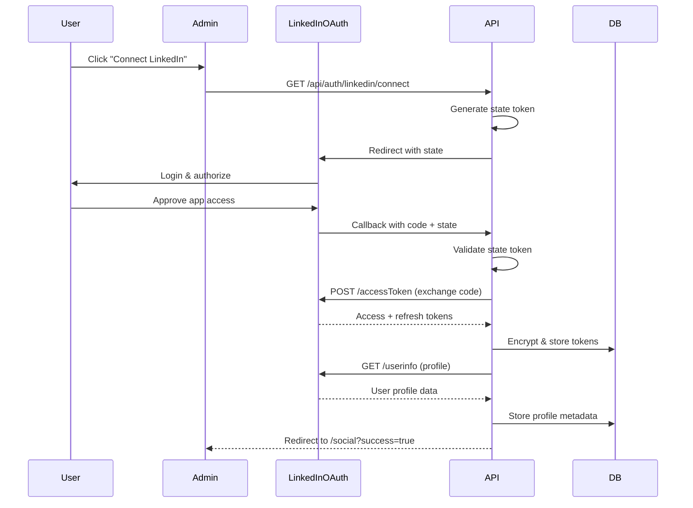
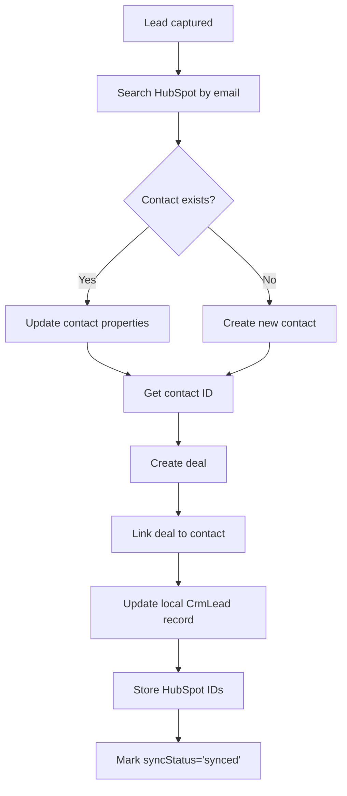

# Integrations & Communications
**External Services, Emails, and Data Sync**

> **Generated:** December 2024  
> **Purpose:** Complete integration and communication documentation

---

## Table of Contents
1. [Email Templates & Triggers](#email-templates--triggers)
2. [LinkedIn Integration](#linkedin-integration)
3. [HubSpot CRM Integration](#hubspot-crm-integration)
4. [Resend Email Service](#resend-email-service)
5. [Webhooks & Event Handling](#webhooks--event-handling)

---

## Email Templates & Triggers

### Template Catalog

| Template Name | Trigger | Personalization | Timing | Purpose |
|---------------|---------|-----------------|--------|---------|
| **Subscription Confirmation** | User subscribes to newsletter | `{{firstName}}`, `{{confirmLink}}` | Immediate | Verify email address |
| **Welcome Email** | User confirms subscription | `{{firstName}}` | Immediate after confirm | Welcome new subscriber |
| **Weekly Digest** | Scheduled campaign | `{{firstName}}`, `{{articles}}` | Weekly (Friday 9 AM) | Share latest content |
| **New Content Notification** | Content published with `emailNotificationSent=true` | `{{title}}`, `{{excerpt}}`, `{{readLink}}` | Immediate after publish | Announce new content |
| **Unsubscribe Confirmation** | User unsubscribes | `{{email}}` | Immediate | Confirm unsubscription |
| **Contact Form Receipt** | Form submission | `{{name}}`, `{{message}}` | Immediate | Acknowledge lead capture |
| **Lead Notification (Internal)** | New lead captured | All lead details | Immediate | Notify admin of new lead |

### Email Template Structure

```html
<!DOCTYPE html>
<html>
<head>
  <meta charset="UTF-8">
  <meta name="viewport" content="width=device-width, initial-scale=1.0">
  <title>{{subject}}</title>
</head>
<body>
  <!-- Header with logo -->
  <div style="background: #f7f7f7; padding: 20px; text-align: center;">
    
  </div>
  
  <!-- Main content -->
  <div style="padding: 40px 20px; max-width: 600px; margin: 0 auto;">
    <h1>{{title}}</h1>
    <p>Hi {{firstName}},</p>
    
    {{content}}
    
    <p style="margin-top: 30px;">
      <a href="{{ctaLink}}" style="background: #0066cc; color: white; padding: 12px 24px; text-decoration: none; border-radius: 4px;">
        {{ctaText}}
      </a>
    </p>
  </div>
  
  <!-- Footer with legal -->
  <div style="background: #333; color: white; padding: 20px; text-align: center; font-size: 12px;">
    <p>{{companyName}}</p>
    <p>{{footerAddress}}</p>
    <p>
      <a href="{{unsubscribeLink}}" style="color: #ccc;">Unsubscribe</a> |
      <a href="{{preferencesLink}}" style="color: #ccc;">Preferences</a> |
      <a href="{{privacyLink}}" style="color: #ccc;">Privacy Policy</a>
    </p>
  </div>
</body>
</html>
```

### Variable Replacement Logic

**Code:** `apps/admin/lib/email/resend-client.ts`

```typescript
export function replaceVariables(html: string, vars: Record<string, string>): string {
  let result = html;
  for (const [key, value] of Object.entries(vars)) {
    const regex = new RegExp(`{{${key}}}`, 'g');
    result = result.replace(regex, value);
  }
  return result;
}
```

### UTM Tagging

All email links automatically get UTM parameters:

| Parameter | Value | Purpose |
|-----------|-------|---------|
| `utm_source` | `newsletter` | Email source |
| `utm_medium` | `email` | Medium type |
| `utm_campaign` | `{{campaignId}}` | Specific campaign |
| `utm_content` | `{{linkPosition}}` | Link placement |

**Example:**
```
https://khaledaun.com/blog/article?utm_source=newsletter&utm_medium=email&utm_campaign=weekly_42&utm_content=cta_button
```

---

## LinkedIn Integration

### OAuth Flow



### API Configuration

**OAuth App Settings:**
- Client ID: `{{LINKEDIN_CLIENT_ID}}`
- Client Secret: `{{LINKEDIN_CLIENT_SECRET}}`
- Redirect URI: `https://admin.khaledaun.com/api/auth/linkedin/callback`
- Scopes: `w_member_social`, `r_liteprofile`

**Token Encryption:**
- Algorithm: AES-256-GCM
- Key: `LINKEDIN_ENCRYPTION_KEY` (256-bit, 32-byte hex)
- Storage: Encrypted in `social_accounts.access_token` and `refresh_token`

### Posting Types

#### 1. Text-Only Post
```json
{
  "author": "urn:li:person:{{accountId}}",
  "lifecycleState": "PUBLISHED",
  "specificContent": {
    "com.linkedin.ugc.ShareContent": {
      "shareCommentary": {
        "text": "Post content here..."
      },
      "shareMediaCategory": "NONE"
    }
  },
  "visibility": {
    "com.linkedin.ugc.MemberNetworkVisibility": "PUBLIC"
  }
}
```

#### 2. Text + Single Image
```json
{
  "author": "urn:li:person:{{accountId}}",
  "lifecycleState": "PUBLISHED",
  "specificContent": {
    "com.linkedin.ugc.ShareContent": {
      "shareCommentary": {
        "text": "Post content..."
      },
      "shareMediaCategory": "IMAGE",
      "media": [
        {
          "status": "READY",
          "media": "urn:li:digitalmediaAsset:{{assetId}}"
        }
      ]
    }
  },
  "visibility": {
    "com.linkedin.ugc.MemberNetworkVisibility": "PUBLIC"
  }
}
```

#### 3. Link Attachment (UGC)
```json
{
  "author": "urn:li:person:{{accountId}}",
  "lifecycleState": "PUBLISHED",
  "specificContent": {
    "com.linkedin.ugc.ShareContent": {
      "shareCommentary": {
        "text": "Check out this article..."
      },
      "shareMediaCategory": "ARTICLE",
      "media": [
        {
          "status": "READY",
          "originalUrl": "https://khaledaun.com/blog/article"
        }
      ]
    }
  },
  "visibility": {
    "com.linkedin.ugc.MemberNetworkVisibility": "PUBLIC"
  }
}
```

### Rate Limits & Retry

**LinkedIn API Limits:**
- 100 posts per day per user
- 500 API calls per user per day

**Retry Strategy:**
```typescript
const delays = [5 * 60 * 1000, 15 * 60 * 1000, 60 * 60 * 1000]; // 5min, 15min, 1hr
for (let attempt = 0; attempt < 3; attempt++) {
  try {
    const result = await postToLinkedIn(data);
    return result;
  } catch (error) {
    if (attempt < 2) {
      await sleep(delays[attempt]);
    } else {
      throw error; // Final failure
    }
  }
}
```

### Failure Modes

| Error | Cause | Resolution |
|-------|-------|------------|
| **401 Unauthorized** | Token expired | Refresh token, retry |
| **403 Forbidden** | Insufficient permissions | Reconnect account with correct scopes |
| **429 Too Many Requests** | Rate limit hit | Wait & retry with backoff |
| **400 Bad Request** | Invalid post data | Validate content, check field lengths |
| **500 Server Error** | LinkedIn API issue | Retry with exponential backoff |

---

## HubSpot CRM Integration

### Contact Sync Flow



### API Configuration

**Authentication:**
- Method: Private App API Key
- Header: `Authorization: Bearer {{HUBSPOT_API_KEY}}`
- Base URL: `https://api.hubapi.com`

**Required Properties:**
- Contact: `email` (unique identifier)
- Deal: `dealname`, `dealstage`, `pipeline`

### Contact Properties Mapping

| Local Field | HubSpot Property | Notes |
|-------------|------------------|-------|
| `email` | `email` | Required, unique |
| `firstName` | `firstname` | - |
| `lastName` | `lastname` | - |
| `company` | `company` | - |
| `phone` | `phone` | E.164 format |
| `website` | `website` | URL |
| `message` | `hs_content_membership_notes` | Custom property |
| `leadStatus` | `hs_lead_status` | new, contacted, qualified, etc. |
| `source` | `hs_analytics_source` | contact_form, newsletter, etc. |
| `utmSource` | `hs_analytics_source_data_1` | - |
| `utmMedium` | `hs_analytics_source_data_2` | - |
| `utmCampaign` | `hs_analytics_last_url` | - |
| `createdAt` | `createdate` | ISO 8601 |
| `consentGiven` | `hs_legal_basis` | GDPR compliance |

### Deal Creation

```json
{
  "properties": {
    "dealname": "{{firstName}} {{lastName}} - {{company}}",
    "dealstage": "{{HUBSPOT_DEALSTAGE_DISCOVERY_ID}}",
    "pipeline": "{{HUBSPOT_PIPELINE_ID}}",
    "amount": "0",
    "closedate": "{{futureDate}}",
    "hubspot_owner_id": "{{assignedTo}}"
  },
  "associations": [
    {
      "to": {
        "id": "{{contactId}}"
      },
      "types": [
        {
          "associationCategory": "HUBSPOT_DEFINED",
          "associationTypeId": 3
        }
      ]
    }
  ]
}
```

### Deduplication Strategy

1. **Primary:** Search by email
2. **Secondary:** Search by company + name (if email missing)
3. **Create:** Only if no match found
4. **Update:** Merge new data with existing (never overwrite non-empty fields)

### Sync Frequency

| Type | Schedule | Method |
|------|----------|--------|
| **Realtime** | On lead capture | Immediate API call |
| **Nightly Reconciliation** | Daily at 2 AM | Cron job `/api/crm/sync` |
| **Failed Retries** | Every 6 hours | Query `syncStatus='failed'`, retry |

### Error Handling

```typescript
try {
  const contact = await hubspot.createContact(data);
  const deal = await hubspot.createDeal(dealData, contact.id);
  await prisma.crmLead.update({
    where: { id: leadId },
    data: {
      hubspotContactId: contact.id,
      hubspotDealId: deal.id,
      hubspotSyncStatus: 'synced',
      hubspotSyncedAt: new Date(),
    },
  });
} catch (error) {
  await prisma.crmLead.update({
    where: { id: leadId },
    data: {
      hubspotSyncStatus: 'failed',
      hubspotSyncError: error.message,
    },
  });
  // Log error for retry
  logger.error('HubSpot sync failed', { leadId, error });
}
```

---

## Resend Email Service

### API Configuration

**Authentication:**
- Method: API Key
- Header: `Authorization: Bearer {{RESEND_API_KEY}}`
- Base URL: `https://api.resend.com`

**Domain Setup:**
- Send from: `hello@khaledaun.com`
- Reply-to: `khaled@khaledaun.com`
- DNS Records:
  - SPF: `v=spf1 include:resend.net ~all`
  - DKIM: (provided by Resend)
  - DMARC: `v=DMARC1; p=quarantine; rua=mailto:dmarc@khaledaun.com`

### Send Email API

```typescript
interface SendEmailRequest {
  from: string; // "Khaled Aun <hello@khaledaun.com>"
  to: string | string[]; // Recipient(s)
  subject: string;
  html: string;
  text?: string; // Plain text fallback
  replyTo?: string;
  cc?: string[];
  bcc?: string[];
  tags?: { name: string; value: string }[];
}

const response = await fetch('https://api.resend.com/emails', {
  method: 'POST',
  headers: {
    'Authorization': `Bearer ${process.env.RESEND_API_KEY}`,
    'Content-Type': 'application/json',
  },
  body: JSON.stringify(emailData),
});
```

**Response:**
```json
{
  "id": "re_abcd1234...",
  "from": "hello@khaledaun.com",
  "to": ["user@example.com"],
  "created_at": "2024-12-01T10:00:00Z"
}
```

### Batch Sending

```typescript
// Send to multiple recipients (max 50 per batch)
const batch = subscribers.slice(0, 50).map(sub => ({
  from: 'hello@khaledaun.com',
  to: sub.email,
  subject: campaign.subject,
  html: replaceVariables(campaign.contentHtml, {
    firstName: sub.firstName,
    unsubscribeLink: `https://khaledaun.com/newsletter/unsubscribe?email=${sub.email}`,
  }),
}));

const response = await fetch('https://api.resend.com/emails/batch', {
  method: 'POST',
  headers: { /* ... */ },
  body: JSON.stringify(batch),
});
```

---

## Webhooks & Event Handling

### Resend Webhook Events

**Endpoint:** `POST /api/webhooks/resend`  
**Authentication:** Webhook signature verification

```typescript
import { verify } from '@resend/node';

const signature = request.headers.get('resend-signature');
const body = await request.text();

if (!verify(body, signature, process.env.RESEND_WEBHOOK_SECRET)) {
  return new Response('Invalid signature', { status: 401 });
}

const event = JSON.parse(body);
```

**Event Types:**

| Event | Description | Action |
|-------|-------------|--------|
| `email.sent` | Email sent to provider | Create EmailEvent (type='sent') |
| `email.delivered` | Email delivered to inbox | Update EmailEvent (type='delivered') |
| `email.opened` | Recipient opened email | Create EmailEvent (type='opened'), increment subscriber.totalOpens |
| `email.clicked` | Recipient clicked link | Create EmailEvent (type='clicked', linkUrl), increment subscriber.totalClicks |
| `email.bounced` | Email bounced | Create EmailEvent (type='bounced', bounceReason), increment campaign.totalBounces |
| `email.complained` | Spam complaint | Create EmailEvent (type='complained'), mark subscriber as unsubscribed |
| `email.unsubscribed` | Unsubscribe clicked | Update subscriber.status='unsubscribed' |

**Event Payload Example:**
```json
{
  "type": "email.opened",
  "created_at": "2024-12-01T10:05:00Z",
  "data": {
    "email_id": "re_abcd1234...",
    "from": "hello@khaledaun.com",
    "to": ["user@example.com"],
    "subject": "Weekly Digest #42",
    "opened_at": "2024-12-01T10:05:00Z",
    "ip": "203.0.113.42",
    "user_agent": "Mozilla/5.0 (iPhone...)",
    "location": "Dubai, UAE"
  }
}
```

**Processing Logic:**
```typescript
switch (event.type) {
  case 'email.opened':
    await prisma.emailEvent.create({
      data: {
        campaignId,
        subscriberId,
        email: event.data.to[0],
        eventType: 'opened',
        providerMessageId: event.data.email_id,
        ipAddress: event.data.ip,
        userAgent: event.data.user_agent,
        location: event.data.location,
        eventTimestamp: new Date(event.data.opened_at),
      },
    });
    await prisma.newsletterSubscriber.update({
      where: { email: event.data.to[0] },
      data: {
        totalOpens: { increment: 1 },
        lastOpenedAt: new Date(),
      },
    });
    break;
  // ... other event types
}
```

### Webhook Retry & Idempotency

**Resend Retry Policy:**
- Max 3 retries
- Exponential backoff: 5s, 25s, 125s
- Timeout: 30s per attempt

**Idempotency:**
- Check `providerEventId` before creating duplicate `EmailEvent`
- Use `upsert` for subscriber metrics

```typescript
await prisma.emailEvent.upsert({
  where: { providerEventId: event.id },
  create: { /* event data */ },
  update: {}, // No-op if duplicate
});
```

---

## Monitoring & Observability

### Integration Health Checks

| Service | Endpoint | Check | Frequency |
|---------|----------|-------|-----------|
| **LinkedIn** | `/api/auth/linkedin/status` | Token validity | On-demand |
| **HubSpot** | Internal health check | API connectivity | Daily |
| **Resend** | Domain verification API | DNS status | Weekly |
| **Supabase** | `/api/health` | Database connection | Every minute (health endpoint) |

### Logging

**Structured Logs (Pino):**
```typescript
logger.info('LinkedIn post created', {
  contentId,
  platform: 'linkedin',
  permalink,
  duration: Date.now() - startTime,
});

logger.error('HubSpot sync failed', {
  leadId,
  error: error.message,
  retryCount: lead.syncAttempts,
});
```

---

**Document Status:** ✅ Complete  
**Last Updated:** December 2024  
**Next Document:** [Quality & Observability](./quality-and-observability.md)

