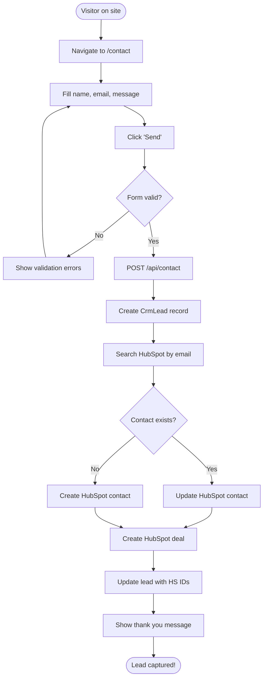

# UI & Human Flows
**Screens, Click-Paths, and User Personas**

> **Generated:** December 2024  
> **Purpose:** Complete UI documentation for human-like testing

---

## Table of Contents
1. [Screen Catalog](#screen-catalog)
2. [Click-Path Flowcharts](#click-path-flowcharts)
3. [User Personas](#user-personas)
4. [Interaction Patterns](#interaction-patterns)

---

## Screen Catalog

### Admin Application (`/apps/admin`)

| URL Path | Page Name | Purpose | Primary Elements | Auth Required | Role Required |
|----------|-----------|---------|------------------|---------------|---------------|
| **Authentication** ||||||
| `/auth/login` | Login | User authentication | Email input, password input, login button, signup link | No | - |
| **Dashboard** ||||||
| `/command-center` | Command Center | Main dashboard & overview | KPI cards, quick actions, recent activity | Yes | All |
| **Content Management** ||||||
| `/content/new` | New Content | Create new content | Type selector, title input, rich text editor, SEO panel, publish button | Yes | AUTHOR+ |
| `/content/[id]` | Edit Content | Edit existing content | Title, content editor, metadata, publish workflow, LinkedIn post button | Yes | AUTHOR+ (own), EDITOR+ (any) |
| `/content/library` | Content Library | List all content | Data table, filters (type, status), search, sort, pagination | Yes | AUTHOR+ |
| **Topics** ||||||
| `/topics` | Topic Queue | List content ideas | Table with topics, status filters, priority sort, create button | Yes | AUTHOR+ |
| `/topics/new` | New Topic | Add topic idea | Title, description, source URL, priority selector, save button | Yes | AUTHOR+ |
| `/topics/[id]` | Topic Details | View/edit topic | Title, description, URL extraction, lock toggle, assign dropdown | Yes | AUTHOR+ |
| **Media** ||||||
| `/media` | Media Library | Manage media assets | Grid/list view toggle, upload dropzone, filters (type, folder), search, preview modal | Yes | AUTHOR+ |
| **AI & HITL** ||||||
| `/ai` | AI Dashboard | AI overview & recent generations | Generation history, model usage stats, quick generate buttons | Yes | AUTHOR+ |
| `/ai/templates` | AI Templates | Manage prompt templates | Template list, create/edit forms, variables preview | Yes | EDITOR+ |
| `/ai/config` | AI Configuration | Configure AI models & settings | Model selection, API key status, temperature settings | Yes | ADMIN+ |
| `/hitl/outline-review` | Outline Review | Human-in-loop outline approval | Generated outline, edit sections, approve/reject buttons | Yes | AUTHOR+ |
| `/hitl/facts-review` | Fact Review | Verify extracted facts | Fact list, confidence scores, approve/reject buttons, notes | Yes | REVIEWER+ |
| **Marketing** ||||||
| `/marketing` | Marketing Dashboard | Email marketing overview | Subscriber count, open rates, campaign stats, recent activity | Yes | EDITOR+ |
| `/marketing/subscribers` | Subscriber Management | Manage newsletter subscribers | Table with subscribers, status filters, export button, manual add | Yes | EDITOR+ |
| `/marketing/campaigns` | Campaign Management | Manage email campaigns | Campaign list, create button, status filters, send/schedule actions | Yes | EDITOR+ |
| **Social & CRM** ||||||
| `/social` | Social Accounts | Manage social connections | LinkedIn connect button, account status, disconnect option | Yes | EDITOR+ |
| `/leads` | Lead Management | View captured leads | Leads table, filters, export, HubSpot sync status | Yes | EDITOR+ |
| **Portfolio & CMS** ||||||
| `/case-studies` | Case Studies | Manage portfolio projects | Case study cards, create button, filters | Yes | EDITOR+ |
| `/case-studies/new` | New Case Study | Add portfolio project | Title, description, images, tech stack, link, save button | Yes | EDITOR+ |
| `/case-studies/[id]/edit` | Edit Case Study | Edit project | Same as new case study | Yes | EDITOR+ |
| `/profile/hero` | Hero Section | Edit homepage hero | Title editor, CTA buttons, media selector | Yes | EDITOR+ |
| `/profile/credentials` | Credentials | Manage credentials/certifications | List of credentials, add/edit/delete | Yes | EDITOR+ |
| `/profile/logo` | Site Logo | Manage site branding | Logo upload, preview, variants | Yes | ADMIN+ |
| `/cms/experiences` | Work Experience | Edit work history | Experience list, add/edit forms, timeline | Yes | EDITOR+ |
| `/cms/hero-media` | Hero Media | Manage hero images/videos | Media grid, upload, set as primary | Yes | EDITOR+ |
| `/cms/hero-titles` | Hero Titles | Edit hero text variations | Title list, add/edit/delete, activation | Yes | EDITOR+ |
| **Blog (Legacy)** ||||||
| `/posts` | Blog Posts | Legacy post management | Post list, create button | Yes | AUTHOR+ |
| `/posts/new` | New Post | Create blog post | Title, content, publish | Yes | AUTHOR+ |
| `/posts/[id]` | Edit Post | Edit blog post | Title, content, publish | Yes | AUTHOR+ (own), EDITOR+ (any) |
| **Analytics & Tools** ||||||
| `/analytics` | Analytics | Content performance metrics | Charts, page views, engagement stats | Yes | All |
| `/seo-checks` | SEO Checker | Standalone SEO validator | URL input, analysis results, recommendations | Yes | AUTHOR+ |

### Public Website (`/apps/site`)

| URL Path | Page Name | Purpose | Primary Elements | Dynamic |
|----------|-----------|---------|------------------|---------|
| `/` | Homepage | Main landing page | Hero section, about, ventures, credentials, experience, contact CTA | Static |
| `/[locale]` | Localized Homepage | Homepage in Arabic/English | Same as homepage | Dynamic (locale) |
| `/contact` | Contact Form | Lead capture | Name, email, company, message, submit button | Static |
| `/[locale]/contact` | Localized Contact | Contact form (AR/EN) | Same as contact | Dynamic (locale) |
| `/newsletter` | Newsletter Signup | Subscribe to newsletter | Email input, optional name fields, submit | Static |
| `/newsletter/confirm` | Confirm Subscription | Verify email subscription | Token validation, success/error message | Dynamic (token) |
| `/newsletter/unsubscribed` | Unsubscribe Confirmation | Confirm unsubscribe | Unsubscribe success message, re-subscribe option | Static |

---

## Click-Path Flowcharts

### 1. Content Creation & Publishing Flow


### 2. Newsletter Subscription Flow

```mermaid
flowchart TD
    Start([Visitor on site]) --> ScrollFooter[Scroll to footer]
    ScrollFooter --> SeeForm[See newsletter form]
    SeeForm --> EnterEmail[Enter email]
    EnterEmail --> Submit[Click 'Subscribe']
    Submit --> API[POST /api/newsletter/subscribe]
    API --> CreateSub[Create subscriber (pending)]
    CreateSub --> SendEmail[Send confirmation email]
    SendEmail --> CheckInbox[User checks inbox]
    CheckInbox --> ClickLink[Click confirm link]
    ClickLink --> ValidateToken[GET /api/newsletter/confirm]
    ValidateToken --> UpdateStatus[Update status='confirmed']
    UpdateStatus --> SyncHS[Sync to HubSpot]
    SyncHS --> ShowSuccess[Show success page]
    ShowSuccess --> End([Subscribed!])
```

### 3. LinkedIn Posting Flow


### 4. Email Campaign Creation Flow


### 5. Contact Form to CRM Flow



---

## User Personas

### Persona 1: Khaled (OWNER)

**Role:** System Owner & Content Creator  
**Age:** 35  
**Location:** Dubai, UAE  
**Tech Savviness:** High

**Goals:**
- Create high-quality content for personal brand
- Automate content distribution (LinkedIn, email)
- Capture and nurture leads for consulting business
- Monitor content performance and engagement
- Maintain full control over system configuration

**Daily Tasks:**
- Write 2-3 LinkedIn posts per week
- Create 1-2 blog articles per month
- Review and approve AI-generated content
- Monitor email campaign analytics
- Check CRM leads and follow up
- Manage team member access (if applicable)

**Pain Points:**
- Manual social media posting is time-consuming
- Hard to maintain consistency across platforms
- Need better SEO optimization tools
- Want more automated lead nurturing

**User Journey (Typical Day):**
1. Login to `/command-center`
2. Check dashboard KPIs (subscribers, opens, leads)
3. Review pending topics in `/topics`
4. Create new content in `/content/new`
5. Use AI to generate outline for article
6. Write and edit content with SEO panel
7. Schedule LinkedIn post for next week
8. Check `/leads` for new inquiries
9. Review `/marketing/campaigns` performance
10. Logout

---

### Persona 2: Layla (EDITOR)

**Role:** Content Manager  
**Age:** 28  
**Location:** Remote  
**Tech Savviness:** Medium-High

**Goals:**
- Publish high-quality content on schedule
- Manage email marketing campaigns
- Grow newsletter subscriber base
- Ensure brand consistency across content
- Collaborate with content creators

**Daily Tasks:**
- Review and approve content submissions
- Create and send weekly email newsletters
- Analyze campaign performance
- Manage media library organization
- Schedule social media posts
- Update CMS content (hero, experiences)

**Pain Points:**
- Need faster content approval workflow
- Want better email template management
- Hard to track content performance across channels
- Need more granular subscriber segmentation

**User Journey (Typical Day):**
1. Login to `/command-center`
2. Check content in review status
3. Navigate to `/content/library?status=review`
4. Approve 3 content pieces
5. Go to `/marketing/campaigns`
6. Create new email campaign
7. Select target audience (confirmed subscribers)
8. Schedule campaign for Friday 9 AM
9. Upload new images to `/media`
10. Organize media into folders
11. Check `/social` for LinkedIn connection status
12. Logout

---

### Persona 3: Ahmed (AUTHOR)

**Role:** Content Creator  
**Age:** 26  
**Location:** Cairo, Egypt  
**Tech Savviness:** Medium

**Goals:**
- Write engaging content quickly
- Use AI to speed up research and drafting
- Meet weekly content quotas
- Improve writing skills through feedback
- Build portfolio of published work

**Daily Tasks:**
- Research topics from queue
- Write 1-2 content pieces per day
- Submit content for review
- Incorporate editorial feedback
- Use AI tools for research and ideation
- Upload related images

**Pain Points:**
- Writer's block and idea generation
- Time-consuming research process
- Waiting for editorial approval
- Unsure about SEO best practices
- Can't publish content directly

**User Journey (Typical Day):**
1. Login to `/command-center`
2. Go to `/topics` to find approved topic
3. Open topic `/topics/[id]`
4. Click "Extract URL" to research
5. Review extracted content
6. Go to `/content/new`
7. Use AI to generate outline
8. Review outline in `/hitl/outline-review`
9. Approve outline sections
10. Write content based on outline
11. Check SEO panel (aim for 70+ score)
12. Add keywords and meta description
13. Upload hero image from `/media`
14. Click "Save Draft"
15. Submit for review
16. Logout

---

### Persona 4: Sara (REVIEWER)

**Role:** Content Reviewer / Editor  
**Age:** 32  
**Location:** London, UK  
**Tech Savviness:** Medium

**Goals:**
- Ensure content quality and accuracy
- Maintain brand voice consistency
- Provide constructive feedback to authors
- Approve content for publication
- Verify factual claims in content

**Daily Tasks:**
- Review submitted content (2-5 pieces/day)
- Verify AI-generated facts
- Provide feedback on drafts
- Approve or reject content
- Check for plagiarism and originality

**Pain Points:**
- Need faster fact-checking tools
- Want side-by-side comparison for revisions
- Hard to track feedback history
- Need better collaboration features

**User Journey (Typical Day):**
1. Login to `/command-center`
2. See notification: "3 items pending review"
3. Go to `/content/library?status=review`
4. Open first content piece
5. Read through content
6. Check SEO score (must be 60+)
7. Verify factual claims
8. Add feedback comments
9. Click "Approve" or "Request Changes"
10. Repeat for other submissions
11. Go to `/hitl/facts-review`
12. Review AI-extracted facts
13. Approve accurate facts
14. Flag questionable claims
15. Logout

---

### Persona 5: Fatima (Subscriber / Lead)

**Role:** Newsletter Subscriber & Potential Client  
**Age:** 40  
**Location:** Riyadh, Saudi Arabia  
**Tech Savviness:** Medium

**Goals:**
- Stay updated on industry insights
- Learn from Khaled's expertise
- Eventually hire Khaled for consulting
- Receive valuable content in inbox

**Pain Points:**
- Too many promotional emails
- Want personalized content
- Privacy concerns with data sharing

**User Journey (Subscription):**
1. Visit `khaledaun.com`
2. Read homepage content
3. Scroll to footer
4. See newsletter signup form
5. Enter email: `fatima@company.com`
6. Click "Subscribe"
7. See message: "Check your email"
8. Open inbox
9. Find confirmation email
10. Click "Confirm Subscription"
11. Redirected to `/newsletter/confirm`
12. See success message
13. Receive welcome email
14. Receive weekly digests

**User Journey (Contact):**
1. Visit `khaledaun.com`
2. Click "Contact" in navigation
3. Fill form:
   - Name: Fatima Al-Said
   - Email: fatima@company.com
   - Company: Tech Innovations Inc.
   - Message: "Interested in digital transformation consulting"
4. Click "Send"
5. See thank you message
6. Receive confirmation email
7. (Backend: Lead created in HubSpot, assigned to Khaled)
8. Khaled follows up within 24 hours

---

## Interaction Patterns

### Button States

| State | Visual | Behavior |
|-------|--------|----------|
| **Default** | Blue background, white text | Cursor pointer, hover effect |
| **Hover** | Darker blue | Slight scale increase |
| **Loading** | Spinner icon, disabled | Cannot click |
| **Success** | Green checkmark (2s) | Then returns to default |
| **Error** | Red shake animation | Shows error tooltip |

### Form Validation

| Field Type | Validation | Error Display | Success Display |
|------------|------------|---------------|-----------------|
| **Email** | RFC 5322 format | Red border + "Invalid email" below | Green checkmark icon |
| **Required** | Not empty | Red border + "Required field" | - |
| **URL** | Valid URL format | Red border + "Invalid URL" | - |
| **Rich Text** | Min 100 chars | Yellow warning if < 100 | Character count below |

### Toast Notifications

| Type | Duration | Position | Dismissible |
|------|----------|----------|-------------|
| **Success** | 3 seconds | Top-right | Yes |
| **Error** | 5 seconds | Top-right | Yes |
| **Warning** | 4 seconds | Top-right | Yes |
| **Info** | 3 seconds | Top-right | Yes |
| **Loading** | Until complete | Top-right | No |

### Modal Interactions

| Action | Trigger | Close Method |
|--------|---------|--------------|
| **Confirm** | Delete, publish, etc. | Click "Confirm", "Cancel", or X |
| **Form** | Create, edit | Click "Save", "Cancel", or X |
| **Preview** | View media, content | Click outside, X, or ESC key |
| **AI Generate** | AI assistant | Click "Accept", "Regenerate", or X |

---

**Document Status:** ✅ Complete  
**Last Updated:** December 2024  
**Next Document:** [Integrations & Communications](./integrations-and-communications.md)

